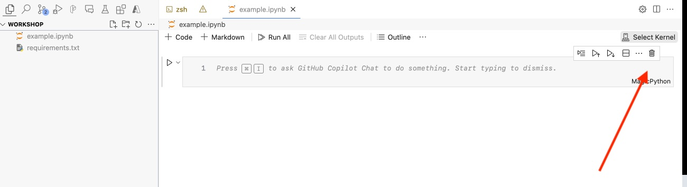
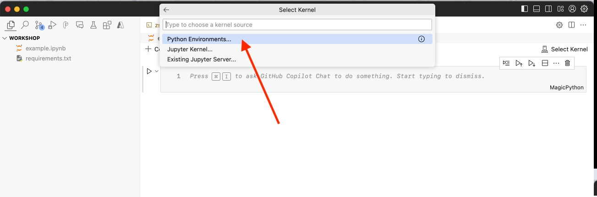
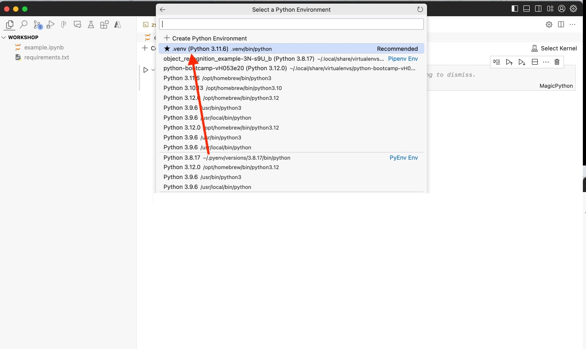
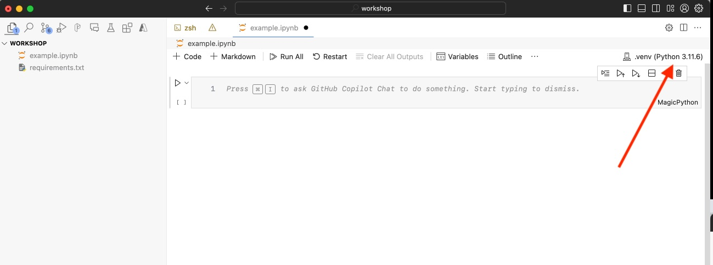

# Part 1: Programming Environment Setup

This section will guide you through the setup of the python development environment using VSCode and Jupyter notebooks. The section also covers following topics:

- Overview of **Python 3** versions and featured offered
- Setting up **Python 3.9+** environment using virtual environments
- Setting up Jupyter notebooks
- VSCode extensions for Python development

## **Python 3** versions and featured offered

- **Python 3.0** (2008): Introduced significant changes like print as a function, integer division returning a float, and Unicode strings.
- **Python 3.1** (2009): Introduced an ordered dictionary type, a new I/O system, and improved the Python standard library.
- **Python 3.2** (2011): Introduced the concurrent.futures module for parallel tasks, the argparse module for command-line arguments, and a stable ABI for extension modules.
- **Python 3.3** (2012): Introduced the yield from syntax for generator delegation, the venv module for creating virtual environments, and the faulthandler module for debugging crashes.
- **Python 3.4** (2014): Introduced the asyncio module for asynchronous I/O, the enum module for enumeration types, and the pathlib module for object-oriented filesystem paths.
- **Python 3.5** (2015): Introduced the async and await syntax for asynchronous programming, the @ operator for matrix multiplication, and type hints.
- **Python 3.6** (2016): Introduced f-strings for easier string formatting, underscores in numeric literals for improved readability, and secrets module for generating cryptographically strong random numbers.
- **Python 3.7** (2018): Introduced data classes for easier creation of classes to store values, and the built-in breakpoint() function for debugging.
- **Python 3.8** (2019): Introduced the walrus operator (:=) for assignment expressions, positional-only parameters, and the Protocol class to define structural type interfaces.
- **Python 3.9** (2020): Introduced the merge (|) and update (|=) operators for dictionaries, the removeprefix() and removesuffix() string methods, and the zoneinfo module for IANA time zones.
- **Python 3.10** (2021): Introduced structural pattern matching (match-case statements), the Parental Scope References in Named Expressions (PEP 657), and error locations in tracebacks.

> **Note**: Python 3.9+ is recommended for this workshop. Python 3.9 is the most widely used version of Python 3. It is the latest version of Python 3 and has many new features and optimizations. Most of the Azure SDKs and libraries are compatible with Python 3.9+.

## Virtual Environments in Python

Virtual environments in Python are isolated environments where you can install packages and dependencies for a specific project without affecting the global Python installation or other projects. This is especially useful when different projects require different versions of the same package.

There are several virtual environment managers available for Python, each with its own set of features and benefits:

- **venv**: A built-in module in Python 3 for creating virtual environments.
- **virtualenv**: A third-party package for creating virtual environments. It is compatible with both Python 2 and Python 3.
- **conda**: A package and environment manager provided by Anaconda, Inc. It is designed for data science and machine learning workflows.
- **pyenv**: A simple Python version management tool that allows you to easily switch between multiple versions of Python.
- **pipenv**: A package manager for Python that combines the functionality of pip and virtualenv in a single tool.
- **poetry**: A modern dependency management tool for Python that allows you to declare and manage project dependencies in a simple and consistent way.

> For this workshop and code samples, we will use `venv` which is a built-in module and has no external dependencies.

### Using `venv` to Create a Virtual Environments

In Python 3, you can create a virtual environment using the built-in `venv` module. Like in other programming languages, a virtual environment is a self-contained directory tree that contains a Python installation for a particular version of Python, plus a number of additional packages. All the packages that you install in this environment will be isolated from the global Python environment.

> Most of the code samples and projects follow a convention calling their virtual environment directory `.venv`. This is a common convention, but you can name your virtual environment directory anything you like.

### 🛠️ Excercise: Create a Virtual Environment

You can follow along these steps in another instance of VSCode open in the `workshop` directory. If you have already followed instructions in [README](../README.md) to setup your environment, you can skip this exercise.

**✅ Step 1: Virtual Environment Creation:**

To create a virtual environment using `venv`, follow these steps:

1. Open a terminal or command prompt.
2. Navigate to `workshop` directory directory.
3. Run the command `python3 -m venv .venv` (where ".venv" is the name of your virtual environment).

```bash
python3 -m venv env
```

This will create a new directory called `env` in your project directory. This directory will contain a copy of the Python interpreter, the standard library, and various supporting files.

> To create a Python virtual environment for a Python version, you first need to ensure that Python version is installed on your system. You can check the Python version by running `python --version` or `python3 --version` in the terminal.

You `workshop` folder could look like this:

> Sample directory structure shows a `bin` directory, which is typical for Unix-like systems. If you're on Windows, you should have a `Scripts` directory instead:

```plaintext
.
└── .venv
    ├── bin
    │   ├── Activate.ps1
    │   ├── activate
    │   ├── activate.csh
    │   ├── activate.fish
    │   ├── pip
    │   ├── pip3
    │   ├── pip3.11
    │   ├── python -> python3.11
    │   ├── python3 -> python3.11
    │   └── python3.11 -> /opt/homebrew/opt/python@3.11/bin/python3.11
    ├── include
    │   └── python3.11
    ├── lib
    │   └── python3.11
    └── pyvenv.cfg

7 directories, 11 files
```

**✅ Step 2: Activate the Virtual Environment:**

Activate the virtual environment:

- **On Windows**, run `.venv\Scripts\Activate`.
- **On Unix or MacOS**, run `source .venv/bin/activate`.

Now you can install packages using `pip install` that are local to this environment. When the virtual environment is activated, your shell prompt will show the name of the environment. Any packages you install while the environment is activated will be installed in that environment, not globally.

Your command prompt should now look something like this:

```plaintext
(.venv) $
```

To deactivate the virtual environment and return to your global Python environment, simply run the command `deactivate`.

To make sure you have the correct version of Python installed and activated, you can get into interactive mode and check the version:

```bash
python
```

It should show the version of Python you installed and activated with interactive mode:

```plaintext
Python 3.11.6 (main, Oct  2 2023, 13:45:54) [Clang 15.0.0 (clang-1500.0.40.1)] on darwin
Type "help", "copyright", "credits" or "license" for more information.
>>>
```

Now you can write a simple Python script and run it to make sure everything is working as expected.

```python
>>> import sys
>>> sys.executable
```

This should return the path to the Python interpreter in your virtual environment. Simply run `exit()` to exit the interactive mode.

**✅ Step 3: Install Required Packages:**

After you setup and activate your virtual environment, you can install required packages using `pip install` command. For example, to install `numpy` package, you can run:

```bash
pip install numpy
```

However, common practice is to use `requirements.txt` file to install all the required packages. This is a similar convention in other programming languages like JavaScript, where you use `package.json` file to install all the required packages.

A requirements.txt file is a file that contains a list of items to be installed using pip install. This file is often used in collaboration settings and it helps to ensure that all dependencies for a project are installed.

Each line of the requirements.txt file includes a library and its version number. For example:

```plaintext
numpy==1.21.2
pandas==1.3.3
```

If you don't have `requirements.txt` file, you can generate a `requirements.txt` file for your current environment by running `pip freeze > requirements.txt`. This will create a `requirements.txt` file with all the current packages and their respective versions. Over time, a project can accumulate a number of dependencies, and it can be hard to keep track of them all. `pip freeze` provides a quick way to view all installed packages.

For this workshop, we have a small number of packages that we will use. Let's create a `requirements.txt` file with the following content:

```plaintext
promptflow[azure]
promptflow-tools
ipython
ipykernel
nbstripout
```

These packages are:

- **`promptflow[azure]:`** A package for managing interactive prompts, with Azure support.
- **`promptflow-tools:`** Tools for working with the PromptFlow package.
- **`ipython:`** An interactive command-line terminal for Python.
- **`ipykernel:`** IPython kernel for Jupyter, allows using IPython features in Jupyter notebooks.
- **`nbstripout:`** A tool for stripping output from Jupyter notebooks, useful for version control.

> `nbstripout` is a tool that can remove the output from Jupyter notebooks. When you run a Jupyter notebook, the output of each cell is saved in the notebook file. This can be problematic when using version control, as the output can change each time the notebook is run, even if the code hasn't changed. This can lead to large diffs and merge conflicts.  

While your command prompt is still in the virtual environment, you can install all the required packages using the following command: 
*(this will take a while depending on your internet connection speed and the number of packages)*

```bash
pip install -r requirements.txt
```

To check if the packages are installed correctly, you can run `pip list` to see all the installed packages in your virtual environment.

In our case, we need to make sure you have promptflow installed correctly:

```bash
pf
```

## Jupyter Notebooks

Jupyter Notebook is an open-source web application that allows you to create and share documents that contain live code, equations, visualizations, and narrative text. It is widely used for data cleaning and transformation, numerical simulation, statistical modeling, data visualization, machine learning, and much more.

Jupyter Notebooks are a great tool for prototyping and experimenting with code. They allow you to write and execute code, view the results, and add explanatory text all in one place. They are also a great way to share your work with others.

You can run Jupyter Notebooks in your local environment, or in the cloud using services like Azure Notebooks, Google Colab, or Binder. In our case, we will run Jupyter Notebooks in our local environment on VSCode using the Jupyter extension.

If you are running this workshop in a [Devcontainer](https://code.visualstudio.com/docs/remote/containers), you can skip the following steps as the Jupyter extension is already installed in the Devcontainer. Otherwise, make sure you have following extensions installed in your VSCode:

- **Jupyter** by Microsoft
- **Python** by Microsoft

> From this point on, you can follow along in the VSCode instance open in the `workshop` directory and we assume you have the correct extensions installed. Full list of extensions required for this workshop can be found in the [devcontainer.json](../.devcontainer/devcontainer.json).

### 🛠️ Excercise: Setting up Jupyter Notebooks

Jupyter Notebooks use a special file extension `.ipynb` and can be run in a Jupyter server. In our case, we will use the Jupyter extension in VSCode to run Jupyter Notebooks. Every time you open a Jupyter Notebook, a new Jupyter server is started in the background. This server requires a kernel to run the code. A kernel is a program that runs and introspects the user's code. The Jupyter extension in VSCode comes with a default Python kernel, but you can install other kernels as well. In our case, we will use the `.venv` created earlier as the kernel for our Jupyter Notebooks. This will make sure that the Jupyter Notebooks run in the same environment as our code.

> `.ipynb` stands for **i**nteractive **py**thon **n**ote**b**ook 😇

**✅ Step 1: Open a Jupyter Notebook:**

1. Open VSCode and navigate to the `workshop` directory.
2. Create a new file called `example.ipynb`.
3. Click on the `example.ipynb` file to open it in the editor.
4. Change the kernel to `.venv` by clicking on the kernel name in the top right corner of the notebook and selecting `.venv`.









Now that you have connected your Jupyter Notebook to the `.venv` environment, you can start writing code in the notebook. You can run the code cells by clicking the `Run Cell` button or by pressing `Shift + Enter`.

**✅ Step 2: Run a Simple Code:**

You can run a simple code cell to make sure everything is working as expected. For example, you can run the following code cell to print the environment this notebook is running in:

```python
import sys

# Get the shell
shell = sys.executable
print("Shell:", shell)

# Get the profile
profile = sys.argv[0]
print("Profile:", profile)

!python --version
```

This will output the Python version and the environment this notebook is running in:

```plaintext
Shell: /Users/username/workshop/.venv/bin/python
Profile: /Users/username/Library/Jupyter/runtime/nbserver-1234-open.html
Python 3.11.6
```

**✅ Step 3: Removing Outputs from Notebooks:**

When you run a Jupyter notebook, the output of each cell is saved in the notebook file. This can be problematic when using version control, as the output can change each time the notebook is run, even if the code hasn't changed. This can lead to large diffs and merge conflicts. To avoid this, you can use the `nbstripout` tool to remove the output from Jupyter notebooks.