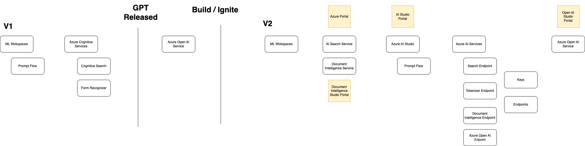
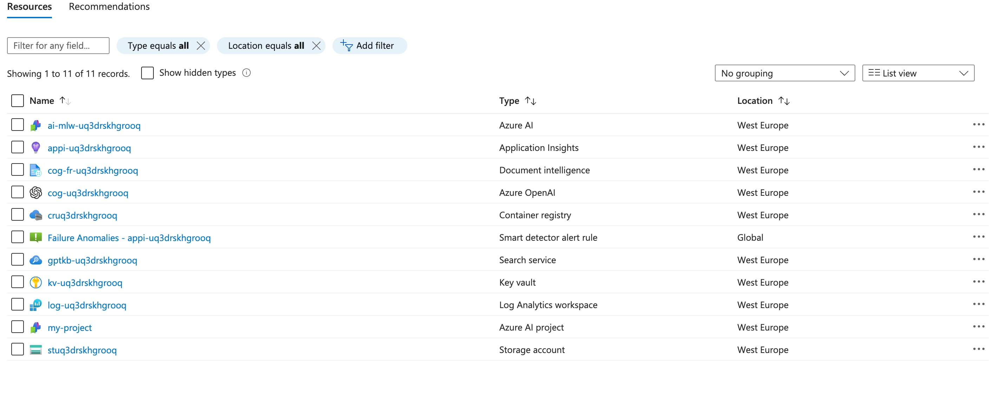

# Part 2 - Azure Infrastructure Setup

This section will guide you through the setup of the Azure resources for the code samples and the workshop. The infrastructure setup can be seen as minimum viable infrastructure required for adding AI to your application. The section also covers following topics:

- Azure AI Services Overview
- Deploying Azure resources using Azure Developer CLI

## Azure AI Services Overview



Refer to the diagram above for the Azure AI Services Overview. The diagram shows the services that will be used in the workshop. The rough timeline and name changes of the services to reflect the current state of the services.

Currently we have 3 portals for developing AI applications on Azure:

1. [Azure Portal](https://portal.azure.com)
2. [Azure AI Studio (**preview**)](https://ai.azure.com/)
3. [Azure Open AI Studio](https://oai.azure.com/portal)

As of writing this workshop, [Azure AI Studio (**preview**)](https://ai.azure.com/) is still in preview. It is a new portal for developing AI applications on Azure aimed to provide a unified experience. However, most of the workshop and code samples leverage [Bicep](https://learn.microsoft.com/en-us/azure/azure-resource-manager/bicep/overview?tabs=bicep) for deploying Azure resources. Bicep is a Domain Specific Language (DSL) for deploying Azure resources declaratively. It aims to drastically simplify the authoring experience with a cleaner syntax and better support for modularity and code re-use.

### Azure AI services and the AI ecosystem

[Azure AI services](https://learn.microsoft.com/en-us/azure/ai-services/what-are-ai-services) provides capabilities to solve general problems such as analyzing text for emotional sentiment or analyzing images to recognize objects or faces. You don't need special machine learning or data science knowledge to use these services.

For this workshop and the code samples, we will be using the following Azure AI services:

| Service | Description |
| --- | --- |
| [Azure AI Search](../search/index.yml) | AI-powered cloud search to your mobile and web apps |
| [Azure OpenAI](./openai/index.yml) | Perform a wide variety of natural language tasks |
| [Document Intelligence](./document-intelligence/index.yml) | Turn documents into usable data at a fraction of the time and cost |

## Azure Developer CLI (azdev)

[Azure Developer CLI (azd)](https://learn.microsoft.com/en-us/azure/developer/azure-developer-cli/overview) is an open-source tool that accelerates the time it takes for you to get your application from local development environment to Azure. azd provides best practice, developer-friendly commands that map to key stages in your workflow, whether you're working in the terminal, your editor or integrated development environment (IDE), or CI/CD (continuous integration/continuous deployment).

You can use `azd` with extensible blueprint templates that include everything you need to get an application up and running on Azure. These templates include reusable infrastructure as code assets and proof-of-concept application code that can be replaced with your own app code. You can also create your own template or find one to build upon.

## 🛠️ Exercise: Create Azure Resources

In this exercise, you will create the Azure resources required for the workshop using Azure Developer CLI (azd). The resources include:

- Azure AI Search
- Azure OpenAI
- Azure Document Intelligence
- Azure AI Studio
  - Azure Storage Account
  - Azure Key Vault
  - Azure Container Registry

Conventional way of organising `azd` projects is to have a `infra` directory with the bicep files and a `src` or `app` directory with the application code. The `infra` directory contains the bicep files that define the infrastructure for the application. The `src` or `app` directory contains the application code. We will use `app` directory for the workshop.

### ✅ Step 1: Initialize Minimal Azure Developer CLI Project

While your command prompt is still in the virtual environment, start a new project using the following command in the root folder of the workshop:q

```bash
azd init --template azd-starter-bicep
```

Select the following options:

```bash
 * .gitignore
? What would you like to do with these files? **Keep my existing files unchanged**

? What is the name of your project? **gen-ai-workshop**
```

This will create update your folder structure with new files and folders.

```bash
.
├── .azure
│   ├── config.json
│   └── gen-ai-workshop
├── azure.yaml
├── infra
│   ├── abbreviations.json
│   ├── core
│   ├── main.bicep
│   └── main.parameters.json
```

To avoid comitting the `.azure` folder, add the following line to your `.gitignore` file:

```bash
.azure
```

### ✅ Step 2: Update AI Services Resources

First, we need to replace the `ai/cognitiveservices.bicep` with the latest version of the resources:

1. It takes several parameters like name, location, tags, customSubDomainName, deployments, kind, publicNetworkAccess, sku, and allowedIpRules. These parameters are used to customize the creation of the Cognitive Services instance.
2. It creates a resource of type Microsoft.CognitiveServices/accounts with the provided parameters. This is the main Cognitive Services account.
3. If there are any deployments specified in the deployments array, it creates those deployments under the Cognitive Services account. Each deployment is created with its own properties and SKU (Stock Keeping Unit), which determines the tier and capacity of the deployment.
4. Finally, it outputs several properties of the created Cognitive Services account, including the endpoint, id, name, apiKey, and apiVersion. These can be used to interact with the Cognitive Services instance once it's created.

Complete following changes in `ai/cognitiveservices.bicep`

```diff
L:24
-- resource account 'Microsoft.CognitiveServices/accounts@2023-05-01' = {

++ resource account 'Microsoft.CognitiveServices/accounts@2023-10-01-preview' = {

L:38
-- resource deployment 'Microsoft.CognitiveServices/accounts/deployments@2023-05-01' = [for deployment in deployments: {

++ resource deployment 'Microsoft.CognitiveServices/accounts/deployments@2023-10-01-preview' = [for deployment in deployments: {

L:54
++ output apiKey string = listKeys(account.id, '2023-10-01-preview').key1
++ output apiVersion string = account.apiVersion
```

### ✅ Step 3: Create AI Studio Resources

> As of writing this workshop, AI Studio is still in preview. Please check the latest documentation for the latest changes.

Create a new file `code/ai/ai-studio.bicep` and add the following code:

1. It takes several parameters like location, tags, aiResourceName, aiProjectName, aiResourceFriendlyName, aiResourceDescription, applicationInsightsId, containerRegistryId, keyVaultId, and storageAccountId. These parameters are used to customize the creation of the Azure Machine Learning workspace and project.
2. It creates a resource of type `Microsoft.MachineLearningServices/workspaces` with the provided parameters. This is the main Azure Machine Learning workspace. AI Studio portal leverages the underlying Azure Machine Learning workspace. The workspace is configured with a system-assigned managed identity and linked to several dependent resources like a Key Vault, a Storage Account, an Application Insights instance, and a Container Registry.
3. It creates another resource of type `Microsoft.MachineLearningServices/workspaces`, which represents a project within the AI Studio. The project is also configured with a system-assigned managed identity and linked to the workspace via the `hubResourceId` property.
4. Finally, it outputs the resource ID of the created Azure Machine Learning workspace. This ID can be used to interact with the workspace once it's created.

```bicep
// Creates an Azure AI resource with proxied endpoints for the Azure AI services provider

@description('Azure region of the deployment')
param location string

@description('Tags to add to the resources')
param tags object

@description('AI resource name')
param aiResourceName string

@description('AI project name')
param aiProjectName string

@description('AI resource display name')
param aiResourceFriendlyName string = aiResourceName

@description('AI resource description')
param aiResourceDescription string

@description('Resource ID of the application insights resource for storing diagnostics logs')
param applicationInsightsId string

@description('Resource ID of the container registry resource for storing docker images')
param containerRegistryId string

@description('Resource ID of the key vault resource for storing connection strings')
param keyVaultId string

@description('Resource ID of the storage account resource for storing experimentation outputs')
param storageAccountId string

resource aiResource 'Microsoft.MachineLearningServices/workspaces@2023-10-01' = {
  name: aiResourceName
  location: location
  tags: tags
  identity: {
    type: 'SystemAssigned'
  }
  properties: {
    // workspace organization
    friendlyName: aiResourceFriendlyName
    description: aiResourceDescription

    // dependent resources
    keyVault: keyVaultId
    storageAccount: storageAccountId
    applicationInsights: applicationInsightsId
    containerRegistry: containerRegistryId
  }
  kind: 'hub'
}

resource aiProject 'Microsoft.MachineLearningServices/workspaces@2023-10-01' = {
  name: aiProjectName
  location: location
  tags: tags
  identity: {
    type: 'SystemAssigned'
  }
  properties: {
    hubResourceId: aiResource.id
  }
  kind: 'project'
}

output aiResourceID string = aiResource.id
```

### ✅ Step 4: Update main.bicep

Update the `main.bicep` file to include the new resources:

1. The file starts with a series of parameters, which are inputs that can be provided when deploying the template. These parameters include things like the environment name, location, resource group name, and various configuration options for the resources being deployed.
2. Next, it loads a JSON file containing abbreviations and creates a unique string to be used in resource names.
3. Then, it declares a series of resources to be deployed. These include a resource group, cognitive services (OpenAI and FormRecognizer), a search service, a storage account, a container registry, a key vault, a log analytics workspace, application insights, and an AI Studio project.
4. Each resource is declared using a Bicep module, which is a reusable piece of Bicep code that can be used to create a specific type of resource. The parameters for each module are set using the parameters declared at the start of the file and the outputs of other modules.
5. Finally, it assigns various roles to a user or app, allowing them to interact with the resources that have been deployed. These roles are assigned using another set of Bicep modules, and the roles assigned depend on the configuration options provided at the start of the file.

```bicep
targetScope = 'subscription'

@minLength(1)
@maxLength(64)
@description('Name of the the environment which is used to generate a short unique hash used in all resources.')
param environmentName string

@minLength(1)
@description('Primary location for all resources')
param location string

param resourceGroupName string = ''

// The free tier does not support managed identity (required) or semantic search (optional)
@allowed([ 'free', 'basic', 'standard', 'standard2', 'standard3', 'storage_optimized_l1', 'storage_optimized_l2' ])
param searchServiceSkuName string // Set in main.parameters.json
param searchIndexName string // Set in main.parameters.json
param searchServiceSemanticRankerLevel string // Set in main.parameters.json
var actualSearchServiceSemanticRankerLevel = (searchServiceSkuName == 'free') ? 'disabled' : searchServiceSemanticRankerLevel
param useSearchServiceKey bool = searchServiceSkuName == 'free'

param storageContainerName string = 'content'
param storageSkuName string // Set in main.parameters.json

@allowed([ 'azure', 'openai' ])
param openAiHost string // Set in main.parameters.json

param useGPT4V bool = false

param searchServiceSecretName string = 'searchServiceSecret'

param openAiSkuName string = 'S0'
param formRecognizerSkuName string = 'S0'

param chatGptDeploymentName string // Set in main.parameters.json
param chatGptDeploymentCapacity int = 30
param chatGpt4vDeploymentCapacity int = 10
param chatGptModelName string = 'gpt-35-turbo'
param chatGptModelVersion string = '0301'
param embeddingDeploymentName string // Set in main.parameters.json
param embeddingDeploymentCapacity int = 30
param embeddingModelName string = 'text-embedding-ada-002'
param gpt4vModelName string = 'gpt-4'
param gpt4vDeploymentName string = 'gpt-4v'
param gpt4vModelVersion string = 'vision-preview'

param tenantId string = tenant().tenantId

// get your principalId from the output of the following command:
// az ad signed-in-user show
@description('Id of the user or app to assign application roles')
@metadata({
  azd: {
    type: 'string'
  }
})
param principalId string

var abbrs = loadJsonContent('abbreviations.json')
var resourceToken = toLower(uniqueString(subscription().id, environmentName, location))
var tags = { 'azd-env-name': environmentName }

// Organize resources in a resource group
resource resourceGroup 'Microsoft.Resources/resourceGroups@2021-04-01' = {
  name: !empty(resourceGroupName) ? resourceGroupName : '${abbrs.resourcesResourceGroups}${environmentName}'
  location: location
  tags: tags
}

var defaultOpenAiDeployments = [
  {
    name: chatGptDeploymentName
    model: {
      format: 'OpenAI'
      name: chatGptModelName
      version: chatGptModelVersion
    }
    sku: {
      name: 'Standard'
      capacity: chatGptDeploymentCapacity
    }
  }
  {
    name: embeddingDeploymentName
    model: {
      format: 'OpenAI'
      name: embeddingModelName
      version: '2'
    }
    sku: {
      name: 'Standard'
      capacity: embeddingDeploymentCapacity
    }
  }
]

var openAiDeployments = concat(defaultOpenAiDeployments, useGPT4V ? [
    {
      name: gpt4vDeploymentName
      model: {
        format: 'OpenAI'
        name: gpt4vModelName
        version: gpt4vModelVersion
      }
      sku: {
        name: 'Standard'
        capacity: chatGpt4vDeploymentCapacity
      }
    }
  ] : [])

module openAi 'core/ai/cognitiveservices.bicep' = if (openAiHost == 'azure') {
  name: 'openai'
  scope: resourceGroup
  params: {
    name: '${abbrs.cognitiveServicesAccounts}${resourceToken}'
    location: location
    tags: tags
    sku: {
      name: openAiSkuName
    }
    deployments: openAiDeployments
  }
}

// FormRecognizer is a.k.a Document Intelligence
// https://learn.microsoft.com/en-us/azure/ai-services/create-account-bicep?tabs=CLI
module formRecognizer 'core/ai/cognitiveservices.bicep' = {
  name: 'formrecognizer'
  scope: resourceGroup
  params: {
    name: '${abbrs.cognitiveServicesFormRecognizer}${resourceToken}'
    kind: 'FormRecognizer'
    location: location
    tags: tags
    sku: {
      name: formRecognizerSkuName
    }
  }
}

module searchService 'core/search/search-services.bicep' = {
  name: 'search-service'
  scope: resourceGroup
  params: {
    name: 'gptkb-${resourceToken}'
    location: location
    tags: tags
    authOptions: {
      aadOrApiKey: {
        aadAuthFailureMode: 'http401WithBearerChallenge'
      }
    }
    sku: {
      name: searchServiceSkuName
    }
    semanticSearch: actualSearchServiceSemanticRankerLevel
  }
}

module storage 'core/storage/storage-account.bicep' = {
  name: 'storage'
  scope: resourceGroup
  params: {
    name: '${abbrs.storageStorageAccounts}${resourceToken}'
    location: location
    tags: tags
    allowBlobPublicAccess: false
    publicNetworkAccess: 'Enabled'
    sku: {
      name: storageSkuName
    }
    deleteRetentionPolicy: {
      enabled: true
      days: 2
    }
    containers: [
      {
        name: storageContainerName
        publicAccess: 'None'
      }
    ]
  }
}

module containerRegistry 'core/host/container-registry.bicep' = {
  name: '${abbrs.containerRegistryRegistries}${resourceToken}'
  scope: resourceGroup
  params: {
    location: location
    name: '${abbrs.containerRegistryRegistries}${resourceToken}'
  }
}

module keyVault 'core/security/keyvault.bicep' = {
  name: '${abbrs.keyVaultVaults}${resourceToken}'
  scope: resourceGroup
  params: {
    name: '${abbrs.keyVaultVaults}${resourceToken}'
    location: location
  }
}

module logAnalyticsWorkspace 'core/monitor/loganalytics.bicep' = {
  name: '${abbrs.operationalInsightsWorkspaces}${resourceToken}'
  scope: resourceGroup
  params: {
    name: '${abbrs.operationalInsightsWorkspaces}${resourceToken}'
    location: location
  }
}

module applicationInsights 'core/monitor/applicationinsights.bicep' = {
  name: '${abbrs.insightsComponents}${resourceToken}'
  scope: resourceGroup
  params: {
    name: '${abbrs.insightsComponents}${resourceToken}'
    location: location
    logAnalyticsWorkspaceId: logAnalyticsWorkspace.outputs.id
  }
}

// Creates new Azure AI Studio project
module aiResource 'core/ai/ai-studio.bicep' = {
  name: 'ai-${abbrs.machineLearningServicesWorkspaces}${resourceToken}'
  scope: resourceGroup
  params: {
    // workspace organization
    aiResourceName: 'ai-${abbrs.machineLearningServicesWorkspaces}${resourceToken}'
    aiResourceFriendlyName: '${resourceGroupName}-hub'
    aiResourceDescription: 'AI Studio Hub for ${resourceGroupName}'
    aiProjectName: 'my-project'
    location: location
    tags: tags

    // dependent resources
    applicationInsightsId: applicationInsights.outputs.id
    containerRegistryId: containerRegistry.outputs.id
    keyVaultId: keyVault.outputs.id
    storageAccountId: storage.outputs.id

  }
}

// USER ROLES
/*
Read access to view files, models, deployments. The ability to create completion and embedding calls.
https://learn.microsoft.com/en-us/azure/role-based-access-control/built-in-roles#cognitive-services-openai-user
*/
module openAiRoleUser 'core/security/role.bicep' = if (openAiHost == 'azure') {
  scope: resourceGroup
  name: 'openai-role-user'
  params: {
    principalId: principalId
    roleDefinitionId: '5e0bd9bd-7b93-4f28-af87-19fc36ad61bd'
    principalType: 'User'
  }
}

/*
Lets you read and list keys of Cognitive Services.
https://learn.microsoft.com/en-us/azure/role-based-access-control/built-in-roles#cognitive-services-user
*/
module formRecognizerRoleUser 'core/security/role.bicep' = {
  scope: resourceGroup
  name: 'formrecognizer-role-user'
  params: {
    principalId: principalId
    roleDefinitionId: 'a97b65f3-24c7-4388-baec-2e87135dc908'
    principalType: 'User'
  }
}

/*
Read and list Azure Storage containers and blobs. To learn which actions are required for a given data operation, see Permissions for calling blob and queue data operations.
https://learn.microsoft.com/en-us/azure/role-based-access-control/built-in-roles#storage-blob-data-reader
https://learn.microsoft.com/en-us/rest/api/storageservices/authenticate-with-azure-active-directory#permissions-for-calling-blob-and-queue-data-operations
*/

module storageRoleUser 'core/security/role.bicep' = {
  scope: resourceGroup
  name: 'storage-role-user'
  params: {
    principalId: principalId
    roleDefinitionId: '2a2b9908-6ea1-4ae2-8e65-a410df84e7d1'
    principalType: 'User'
  }
}

/*
Read, write, and delete Azure Storage containers and blobs. To learn which actions are required for a given data operation, see Permissions for calling blob and queue data operations.
https://learn.microsoft.com/en-us/azure/role-based-access-control/built-in-roles#storage-blob-data-contributor
*/
module storageContribRoleUser 'core/security/role.bicep' = {
  scope: resourceGroup
  name: 'storage-contribrole-user'
  params: {
    principalId: principalId
    roleDefinitionId: 'ba92f5b4-2d11-453d-a403-e96b0029c9fe'
    principalType: 'User'
  }
}

// Only create if using managed identity (non-free tier)
/*
Grants read access to Azure Cognitive Search index data.
https://learn.microsoft.com/en-us/azure/role-based-access-control/built-in-roles#search-index-data-reader
*/
module searchRoleUser 'core/security/role.bicep' = if (!useSearchServiceKey) {
  scope: resourceGroup
  name: 'search-role-user'
  params: {
    principalId: principalId
    roleDefinitionId: '1407120a-92aa-4202-b7e9-c0e197c71c8f'
    principalType: 'User'
  }
}

/*
Grants full access to Azure Cognitive Search index data.
https://learn.microsoft.com/en-us/azure/role-based-access-control/built-in-roles#search-index-data-contributor
*/

module searchContribRoleUser 'core/security/role.bicep' = if (!useSearchServiceKey) {
  scope: resourceGroup
  name: 'search-contrib-role-user'
  params: {
    principalId: principalId
    roleDefinitionId: '8ebe5a00-799e-43f5-93ac-243d3dce84a7'
    principalType: 'User'
  }
}

/*
Lets you manage Search services, but not access to them.
https://learn.microsoft.com/en-us/azure/role-based-access-control/built-in-roles#search-service-contributor
*/
module searchSvcContribRoleUser 'core/security/role.bicep' = if (!useSearchServiceKey) {
  scope: resourceGroup
  name: 'search-svccontrib-role-user'
  params: {
    principalId: principalId
    roleDefinitionId: '7ca78c08-252a-4471-8644-bb5ff32d4ba0'
    principalType: 'User'
  }
}

output AZURE_LOCATION string = location
output AZURE_TENANT_ID string = tenantId
output AZURE_RESOURCE_GROUP string = resourceGroup.name

// Shared by all OpenAI deployments
output OPENAI_HOST string = openAiHost
output AZURE_OPENAI_EMB_MODEL_NAME string = embeddingModelName
output AZURE_OPENAI_CHATGPT_MODEL string = chatGptModelName
output AZURE_OPENAI_GPT4V_MODEL string = gpt4vModelName

// Specific to Azure OpenAI
output AZURE_OPENAI_SERVICE string = openAi.outputs.name
output AZURE_OPENAI_CHATGPT_DEPLOYMENT string = chatGptDeploymentName
output AZURE_OPENAI_EMB_DEPLOYMENT string = embeddingDeploymentName
output AZURE_OPENAI_GPT4V_DEPLOYMENT string = gpt4vDeploymentName
output AZURE_SEARCH_SERVICE_ENDPOINT string = searchService.outputs.endpoint
output AZURE_OPENAI_ENDPOINT string = openAi.outputs.endpoint
output AZURE_OPENAI_API_KEY string = openAi.outputs.apiKey
output AZURE_OPENAI_API_VERSION string = openAi.outputs.apiVersion

output AZURE_FORMRECOGNIZER_SERVICE string = formRecognizer.outputs.name
output AZURE_FORMRECOGNIZER_ENDPOINT string = formRecognizer.outputs.endpoint
output AZURE_FORMRECOGNIZER_API_KEY string = formRecognizer.outputs.apiKey
output AZURE_FORMRECOGNIZER_API_VERSION string = formRecognizer.outputs.apiVersion

output AZURE_SEARCH_INDEX string = searchIndexName
output AZURE_SEARCH_SERVICE string = searchService.outputs.name
output AZURE_SEARCH_SECRET_NAME string = useSearchServiceKey ? searchServiceSecretName : ''
output AZURE_SEARCH_SEMANTIC_RANKER string = actualSearchServiceSemanticRankerLevel
output AZURE_SEARCH_API_KEY string = searchService.outputs.apiKey

output AZURE_STORAGE_ACCOUNT string = storage.outputs.name
output AZURE_STORAGE_CONTAINER string = storageContainerName
output AZURE_STORAGE_CONNECTION_STRING string = storage.outputs.connectionString
```

### ✅ Step 5: Update Outputs

Search Service and Storage Account outputs are required for the `main.bicep`. We need to update the following bicep files:

**1. Update Search Service:** `core/search/search-services.bicep`

```diff
L:38
-- 
-- var searchIdentityProvider = (sku.name == 'free') ? null : {
--  type: 'SystemAssigned'
-- }


L: 43
-- // The free tier does not support managed identity
-- identity: searchIdentityProvider


++ identity: {
++    type: 'SystemAssigned'
++  }


L: 64
-- output principalId string = !empty(searchIdentityProvider) ? search.identity.principalId : ''
++ output apiKey string = listAdminKeys(search.name, '2021-04-01-preview').primaryKey
```

**2. Update Storage Account:** `core/storage/storage-account.bicep`

```diff
L: 65
++ var storageKeys = listKeys(storage.id, storage.apiVersion)
++ var connectionString = 'DefaultEndpointsProtocol=https;AccountName=${storage.name};AccountKey=${storageKeys.++ keys[0].value};EndpointSuffix=core.windows.net'
++ output connectionString string = connectionString
++ output id string = storage.id
```

### ✅ Step 6: Update main.parameters.json

Replace the `main.parameters.json` file to include the new parameters:

```json
{
  "$schema": "https://schema.management.azure.com/schemas/2019-04-01/deploymentParameters.json#",
  "contentVersion": "1.0.0.0",
  "parameters": {
    "environmentName": {
      "value": "${AZURE_ENV_NAME}"
    },
    "resourceGroupName": {
      "value": "${AZURE_RESOURCE_GROUP}"
    },
    "location": {
      "value": "${AZURE_LOCATION}"
    },
    "openAiServiceName": {
      "value": "${AZURE_OPENAI_SERVICE}"
    },
    "openAiResourceGroupName": {
      "value": "${AZURE_OPENAI_RESOURCE_GROUP}"
    },
    "openAiSkuName": {
      "value": "S0"
    },
    "formRecognizerServiceName": {
      "value": "${AZURE_FORMRECOGNIZER_SERVICE}"
    },
    "formRecognizerResourceGroupName": {
      "value": "${AZURE_FORMRECOGNIZER_RESOURCE_GROUP}"
    },
    "formRecognizerSkuName": {
      "value": "${AZURE_FORMRECOGNIZER_SKU=S0}"
    },
    "searchIndexName": {
      "value": "${AZURE_SEARCH_INDEX=gptkbindex}"
    },
    "searchServiceName": {
      "value": "${AZURE_SEARCH_SERVICE}"
    },
    "searchServiceResourceGroupName": {
      "value": "${AZURE_SEARCH_SERVICE_RESOURCE_GROUP}"
    },
    "searchServiceLocation": {
      "value": "${AZURE_SEARCH_SERVICE_LOCATION}"
    },
    "searchServiceSkuName": {
      "value": "${AZURE_SEARCH_SERVICE_SKU=standard}"
    },
    "searchQueryLanguage": {
      "value": "${AZURE_SEARCH_QUERY_LANGUAGE=en-us}"
    },
    "searchQuerySpeller": {
      "value": "${AZURE_SEARCH_QUERY_SPELLER=lexicon}"
    },
    "searchServiceSemanticRankerLevel": {
      "value": "${AZURE_SEARCH_SEMANTIC_RANKER=free}"
    },
    "storageAccountName": {
      "value": "${AZURE_STORAGE_ACCOUNT}"
    },
    "storageResourceGroupName": {
      "value": "${AZURE_STORAGE_RESOURCE_GROUP}"
    },
    "storageSkuName": {
      "value": "${AZURE_STORAGE_SKU=Standard_LRS}"
    },
    "chatGptDeploymentName": {
      "value": "${AZURE_OPENAI_CHATGPT_DEPLOYMENT=chat}"
    },
    "embeddingDeploymentName": {
      "value": "${AZURE_OPENAI_EMB_DEPLOYMENT=embedding}"
    },
    "openAiHost": {
      "value": "${OPENAI_HOST=azure}"
    },
    "openAiApiKey": {
      "value": "${OPENAI_API_KEY}"
    },
    "openAiApiOrganization": {
      "value": "${OPENAI_ORGANIZATION}"
    },
    "useApplicationInsights": {
      "value": "${AZURE_USE_APPLICATION_INSIGHTS=true}"
    },
    "useVectors": {
      "value": "${USE_VECTORS=true}"
    },
    "useGPT4V": {
      "value": "${USE_GPT4V=false}"
    }
  }
}
```

### ✅ Step 7: Update various outputs

**1. `infra/core/security/keyvault.bicep`:**

```diff
L: 27
++ output id string = keyVault.id
```

**2. `infra/core/monitor/applicationinsights.bicep`:**

```diff
L: 31
++ output id string = applicationInsights.id
```

**3. `infra/core/host/container-registry.bicep`:**

```diff
L: 84
output id string = containerRegistry.id
```

**4. `abbrevations.json`:**

```diff
L: 16
++ "cognitiveServicesComputerVision": "cog-cv-",
```

### ✅ Step 7: Deploy Azure Resources

Now your project is ready to be deployed. Run the following command to deploy the resources. Select the subscription and `(Europe) West Europe` as the location.

```bash
azd up
```

This will deploy the resources to your Azure subscription. You can check the status of the deployment in the Azure Portal.

### ✅ Step 8: Set Environment Variables

This command sets up environment variables required for local development into `.env` file. Notebooks and code samples can read from this file for API Keys and other secrets. `.env` is ignored in `.gitignore` file.

```bash
azd env get-values > .env
```

## 🏁 Milestone Check

You have successfully deployed the Azure resources required for the workshop. You can now proceed to the next section to setup the environment for local development.


