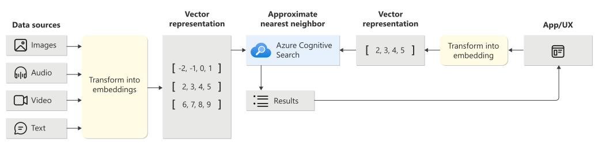

# Part 3: Developing RAG Pattern using Azure AI Search on Jupyter Notebooks

This section will guide you through the process of developing RAG patterns using Azure AI Search on Jupyter Notebooks. The section also covers following topics:

- Environment setup for Jupyter notebooks
- Dependencies and packages required for developing RAG patterns
- Connecting to Azure
- Creating Embeddings for RAG patterns
- Indexing Embeddings
- Performing Vector Search
- Creating Chat Completion

## Embeddings

Embeddings are a type of word representation that allows words with similar meaning to have a similar representation. Embeddings are used to represent words in a way that captures their meaning and context. Embeddings are used in a variety of natural language processing tasks, such as text classification, named entity recognition, and machine translation. You can watch this [video](https://www.youtube.com/watch?v=ArnMdc-ICCM) to understand the concept of embeddings.

## Vector Search using Azure AI Search

Vector search is a type of search that uses vector representations of documents to find similar documents. Vector search is used in a variety of natural language processing tasks, such as information retrieval, question answering, and chatbots.



## Chat Completion in RAG

Retrieval-Augmented Generation (RAG) is a method used in Natural Language Processing (NLP) to generate responses in a chatbot or conversational AI. It combines the strengths of both retrieval-based and generative methods.

1. **Retrieval:** Given an input (like a user's message), the model retrieves relevant documents or messages from a database. This is often done using a method called Dense Passage Retrieval (DPR).
2. **Generation:** The retrieved documents are then used to generate a response. This is often done using a language model like GPT.

Large language models (LLMs) such as GPT-3 and GPT-4 are powerful but their weights are often publicly unavailable and their immense sizes make the models difficult to be tuned. As a result, effectively tuning these models with large-scale supervised data can be challenging. As an alternative, In-Context Learning (ICL) can only use a small number of supervised examples due to context length limits. [In this paper](https://arxiv.org/abs/2305.08848), it is proposed that In-Context Learning (SuperICL) which allows black-box LLMs to work with locally fine-tuned smaller models, resulting in superior performance on supervised tasks. Experiments demonstrate that SuperICL can improve performance beyond state-of-the-art fine-tuned models while addressing the instability problem of in-context learning.

When we retrieve information from a database, we can create an in-context learning environment by providing prompts including the retrieved information. This allows us to fine-tune the model on the fly and generate responses that are more relevant to the retrieved information.

## 🛠️ Excercise: Create PDF Search

In this exercise, you will download a PDF, index using Azure AI Search and ask a question to retrieve augmented answer with a reference to the page it is found.

You will use the `pdf` files from the public URLs and create embeddings for the `pdf` files using [Open AI Text Embedding Model](https://platform.openai.com/docs/guides/embeddings) deployed to your resource groups in [Part 2](./part2.md). You will then index the embeddings and perform vector search to retrieve similar `pdf` files.

Last step is to create a chat completion using the retrieved `pdf` files. This will provide a reference to the page where the answer is found in the `pdf` file.

### ✅ Step 1: Access Azure Resources

In [Part 2](./part2.md), you have created a resource group and deployed related Azure Services. You will need to create a local `.env` file to retrieve keys and endpoints for the services. You will also need to install the required packages and dependencies.

After you run `azd up`, in the same terminal, run the following command in your root folder to create a `.env` file:

```bash
azd env get-values > .env
```

### ✅ Step 2: Update Dependencies

In [Part 1](./part1.md), you have setup the python development environment using VSCode and Jupyter notebooks. You will need to install the required packages and dependencies for this excerise by adding following to `requirements.txt`:

```bash
azure-search-documents
openai
azure-ai-documentintelligence
azure-ai-formrecognizer
tenacity
```

- `azure-ai-documentintelligence` and `azure-ai-formrecognizer` are used to extract text from the `pdf` files.
- `openai` is used to create embeddings for the `pdf` files and for chat completion.
- `azure-search-documents` is used to index the embeddings and perform vector search.
- `tenacity` is used to retry the operations in case of failure.

Now you can perform `pip install -r requirements.txt` to install the required packages and dependencies.

### ✅ Step 3: Setup Jupyter Notebook for PDF Search

Create a new Jupyter notebook and name it `search.ipynb`. You will use this notebook to download a `pdf` file, extract text, create embeddings, index the embeddings and perform vector search.

Add the following code to the notebook in order to setup the environment and dependencies:

```python
# Load the environment variables
print("load environment variables from .env file")

%reload_ext dotenv

from dotenv import load_dotenv

loaded_env = load_dotenv(".env")
print("Loaded .env file:", loaded_env)


# Import required libraries  
import os  
import json  
import openai
import unicodedata
from openai import AzureOpenAI 
from tenacity import retry, wait_random_exponential, stop_after_attempt  
from azure.core.credentials import AzureKeyCredential  
from azure.search.documents import SearchClient, SearchIndexingBufferedSender  
from azure.ai.formrecognizer import DocumentAnalysisClient
from azure.ai.formrecognizer import AnalyzeResult
from azure.search.documents.indexes import SearchIndexClient  
from azure.search.documents.models import (
    QueryAnswerType,
    QueryCaptionType,
    QueryCaptionResult,
    QueryAnswerResult,
    SemanticErrorMode,
    SemanticErrorReason,
    SemanticSearchResultsType,
    QueryType,
    VectorizedQuery,
    VectorQuery,
    VectorFilterMode,    
)
from azure.search.documents.indexes.models import (  
    ExhaustiveKnnAlgorithmConfiguration,
    ExhaustiveKnnParameters,
    SearchIndex,  
    SearchField,  
    SearchFieldDataType,  
    SimpleField,  
    SearchableField,  
    SearchIndex,  
    SemanticConfiguration,  
    SemanticPrioritizedFields,
    SemanticField,  
    SearchField,  
    SemanticSearch,
    VectorSearch,  
    HnswAlgorithmConfiguration,
    HnswParameters,  
    VectorSearch,
    VectorSearchAlgorithmConfiguration,
    VectorSearchAlgorithmKind,
    VectorSearchProfile,
    SearchIndex,
    SearchField,
    SearchFieldDataType,
    SimpleField,
    SearchableField,
    VectorSearch,
    ExhaustiveKnnParameters,
    SearchIndex,  
    SearchField,  
    SearchFieldDataType,  
    SimpleField,  
    SearchableField,  
    SearchIndex,  
    SemanticConfiguration,  
    SemanticField,  
    SearchField,  
    VectorSearch,  
    HnswParameters,  
    VectorSearch,
    VectorSearchAlgorithmKind,
    VectorSearchAlgorithmMetric,
    VectorSearchProfile,
) 
from openai.types.chat import (
    ChatCompletionAssistantMessageParam,
    ChatCompletionContentPartParam,
    ChatCompletionMessageParam,
    ChatCompletionSystemMessageParam,
    ChatCompletionUserMessageParam,
)

# Configure environment variables  
service_endpoint = os.getenv("AZURE_SEARCH_SERVICE_ENDPOINT") 
index_name = "pdfindex" #os.getenv("AZURE_SEARCH_INDEX") 
key = os.getenv("AZURE_SEARCH_API_KEY") 
open_api_version = os.getenv("AZURE_OPENAI_API_VERSION")
open_api_key = os.getenv("AZURE_OPENAI_API_KEY")
open_api_endpoint = os.getenv("AZURE_OPENAI_ENDPOINT")
form_recognizer_key = os.getenv("AZURE_FORMRECOGNIZER_API_KEY")
form_recognizer_endpoint = os.getenv("AZURE_FORMRECOGNIZER_ENDPOINT")

credential = AzureKeyCredential(key)
```

When you run the above code, it will setup the environment variables and credentials required to access the Azure services.

> If your infrastructure is not setup, you can follow the instructions in [Part 2](./part2.md) to setup the Azure resources. If you have access issues, this block will throw an error.

### ✅ Step 4: Download and Index PDF with Embeddings

Add the following code to the notebook in order to download a `pdf` file, extract text, create embeddings, index the embeddings and perform vector search.

1. It retrieves the deployment name and model name from environment variables.
2. It creates an instance of the AzureOpenAI client, using the API key, API version, and endpoint retrieved from environment variables.
3. It creates an instance of the DocumentAnalysisClient, using the Form Recognizer endpoint and key retrieved from environment variables.
4. It starts the analysis of the document using the begin_analyze_document_from_url method. This method is asynchronous and returns a poller object. It waits for the analysis to complete by calling the result method on the poller object.
5. It initializes an empty list to store the analyzed pages. It iterates over each page in the analysis result. For each page, it creates a dictionary with the page number and content (which is built by concatenating all the words in the page). This dictionary is then added to the list of analyzed pages.
6. It defines a function `generate_embeddings` that takes a text and a model, and uses the AzureOpenAI client to generate embeddings for the text. This function is decorated with a retry decorator, which means that if an exception is thrown, the function will be retried a number of times with an exponential backoff. This is to workaroud the rate limits and timeouts.
7. It iterates over each analyzed page, and for each page, it generates embeddings for the content and adds these embeddings to the page dictionary.
8. Finally, it writes the list of analyzed pages (which now includes the embeddings) to a JSON file.

> Code takes roughly 5-10 minutes to complete the embedding. You will see the embeddings in the `docVectors.json` file.

```python
deployment_name = os.getenv("AZURE_OPENAI_EMB_DEPLOYMENT")
model_name = os.getenv("AZURE_OPENAI_EMB_MODEL_NAME")

print("Deployment Name:", deployment_name)
print("Model Name:", model_name)

client = AzureOpenAI(
  api_key = open_api_key,  
  api_version = "2023-05-15",
  azure_endpoint = open_api_endpoint
)

document_analysis_client = DocumentAnalysisClient(
    endpoint=form_recognizer_endpoint, credential=AzureKeyCredential(form_recognizer_key)
)

shell_report_url = "https://reports.shell.com/sustainability-report/2022/_assets/downloads/shell-sustainability-report-2022.pdf"

print(f"Beginning analyze document for {shell_report_url}")
analyze_poller = document_analysis_client.begin_analyze_document_from_url("prebuilt-read", shell_report_url)
analyze_result: AnalyzeResult = analyze_poller.result()

print("Document Analyze Result completed")

analysed_pages = []

for page in analyze_result.pages:
    parsed_page = {
      "pageNumber": f"{page.page_number}",
      "content": ""
    }
    for word in page.words:
        parsed_page["content"] += word.content + " "
    
    analysed_pages.append(parsed_page)

@retry(wait=wait_random_exponential(min=1, max=20), stop=stop_after_attempt(6))
# Function to generate embeddings for title and content fields, also used for query embeddings
def generate_embeddings(text, model):
    try:
        return client.embeddings.create(input = [text], model=model).data[0].embedding
    except Exception as e:
        print("Error:", e) 

print("Generating embeddings for content")
for page in analysed_pages:
    pageNumber = page['pageNumber']
    content = page['content']
    content_embeddings = generate_embeddings(content, deployment_name)
    page['contentVector'] = content_embeddings

# Output embeddings to docVectors.json file
with open("./docVectors.json", "w") as f:
    print("Writing docVectors.json")
    json.dump(analysed_pages, f)
```

### ✅ Step 5: Index PDF with Embeddings

Add the following code to the notebook in order to index the `pdf` file with the embeddings:

1. It creates an instance of the SearchIndexClient using the service endpoint and credentials.
2. It defines the fields for the search index. There are three fields: `pageNumber` (the key field), `content` (a searchable field), and `contentVector` (a field that holds vector data for search).
3. It configures the vector search settings. Two algorithms are used: **Hierarchical Navigable Small World (HNSW)** and **Exhaustive K-Nearest Neighbors (KNN)**. These algorithms are used to search the vector data in the contentVector field.
4. It defines a semantic configuration. This configuration prioritizes the content field for semantic searches and it creates the semantic search settings using the semantic configuration.
5. It creates a new SearchIndex instance with the defined fields, vector search settings, and semantic search settings. If there is an existing index with the same name, it deletes the existing index and creates a new one.

```python
# Create a search index
index_client = SearchIndexClient(endpoint=service_endpoint, credential=credential)

fields = [
    SimpleField(name="pageNumber", type=SearchFieldDataType.String, key=True),
    SearchableField(name="content", type=SearchFieldDataType.String),
    SearchField(name="contentVector", type=SearchFieldDataType.Collection(SearchFieldDataType.Single), searchable=True, vector_search_dimensions=1536, vector_search_profile_name="myHnswProfile"),
]

# Configure the vector search configuration  
vector_search = VectorSearch(
    algorithms=[
        HnswAlgorithmConfiguration(
            name="myHnsw",
            kind=VectorSearchAlgorithmKind.HNSW,
            parameters=HnswParameters(
                m=4,
                ef_construction=400,
                ef_search=500,
                metric=VectorSearchAlgorithmMetric.COSINE
            )
        ),
        ExhaustiveKnnAlgorithmConfiguration(
            name="myExhaustiveKnn",
            kind=VectorSearchAlgorithmKind.EXHAUSTIVE_KNN,
            parameters=ExhaustiveKnnParameters(
                metric=VectorSearchAlgorithmMetric.COSINE
            )
        )
    ],
    profiles=[
        VectorSearchProfile(
            name="myHnswProfile",
            algorithm_configuration_name="myHnsw",
        ),
        VectorSearchProfile(
            name="myExhaustiveKnnProfile",
            algorithm_configuration_name="myExhaustiveKnn",
        )
    ]
)


semantic_config = SemanticConfiguration(
    name="my-semantic-config",
    prioritized_fields=SemanticPrioritizedFields(
        content_fields=[SemanticField(field_name="content")]
    )
)

# Create the semantic settings with the configuration
semantic_search = SemanticSearch(configurations=[semantic_config])

# Create the search index with the semantic settings
index_client.delete_index(index_name)

index = SearchIndex(name=index_name, fields=fields, vector_search=vector_search, semantic_search=semantic_search)
result = index_client.create_or_update_index(index)
print(f' {result.name} created')
```

### ✅ Step 6: Index PDF Embeddings

Add the following code to the notebook in order to index the `pdf` file with the embeddings:

1. It opens the docVectors.json file in read mode. This file is assumed to contain a list of documents in JSON format.
2. It creates an instance of the SearchClient using the service endpoint, index name, and credentials.
3. It uses the upload_documents method of the SearchClient to upload the documents to the search index. The upload_documents method takes a list of documents, where each document is a dictionary that matches the structure of the search index.

```python
# Upload some documents to the index
with open('./docVectors.json', 'r') as file:  
    documents = json.load(file)  
search_client = SearchClient(endpoint=service_endpoint, index_name=index_name, credential=credential)
result = search_client.upload_documents(documents)
print(f"Uploaded {len(documents)} documents")
```

### ✅ Step 7: Perform Vector Similarity Search

Add the following code to the notebook in order to perform vector similarity search:

> This example shows a pure vector search using the vectorizable text query, all you need to do is pass in text and your vectorizer will handle the query vectorization.

1. It generates a query vector by calling the generate_embeddings function with the query string. This function is assumed to return a vector representation of the query string. The VectorizedQuery object is created with this vector, the number of nearest neighbors to return (7 in this case), and the field to search (contentVector).
2. It performs the search by calling the search method of the SearchClient. The search method is called with no search text (since the search is based on the vector query), a query type of SEMANTIC, the vector query, and a select clause that specifies the fields to return (pageNumber and content).
3. It iterates over each result in the search results. For each result, it appends the `page number`, `content`, and `search score` to the search result string.

```python
# Pure Vector Search
query = "operational process safety events in 2022?"

print("Asking question:", query)

search_client = SearchClient(service_endpoint, index_name, credential=credential)

# Generate the query vector using text embeddings from the OpenAI API
vector_query = VectorizedQuery(vector=generate_embeddings(query, model=deployment_name), k_nearest_neighbors=7, fields="contentVector")

print("Searching...")
results = search_client.search(  
    search_text=None,  
    query_type=QueryType.SEMANTIC,
    vector_queries= [vector_query],
    select=["pageNumber", "content"],
)  

search_result = ""
  
for result in results:  
    search_result += f"Page: {result['pageNumber']}\n"
    search_result += f"Content: {result['content']}\n"
    search_result += f"Score: {result['@search.score']}\n\n"
    
print(search_result)
```

### ✅ Step 8: Chat Completion

Using the search result as user content, we can use the OpenAI API to generate a response. The response will be a chat completion that includes the search result as a reference to the page where the answer is found in the `pdf` file.

Add the following code to the notebook in order to perform chat completion:

1. It defines a system chat template. This is a message that sets the context for the chat.
2. It defines a function `create_message` that creates a chat message. The function takes a role (either "user", "system", or "assistant") and the content of the message. It returns a `ChatCompletionMessageParam` object with the role and content. The content is normalized using the Unicode Normalization Form C (NFC).
3. It creates a user message with the query and search result, and adds it to the list of messages. This is the In-Context Learning (ICL) we are providing to the model.
4. It creates a chat completion by calling the create method of the completions property of the chat property of the client. The create method is called with the model name, the list of messages, a temperature of 0.3 (which controls the randomness of the output), a maximum of 1024 tokens, and a number of completions to generate (1 in this case).

```python
chat_model_name = os.getenv("AZURE_OPENAI_CHATGPT_DEPLOYMENT")
print("Chat Model Name:", chat_model_name)

system_chat_template = (
        "You are an intelligent assistant helping Contoso Inc employees for their sustainability report questions. "
        + "Use 'you' to refer to the individual asking the questions even if they ask with 'I'. "
        + "Answer the following question using only the data provided in the sources below. "
        + "For tabular information return it as an html table. Do not return markdown format. "
        + "Include page source as citation"
        + "Each source has a name followed by colon and the actual information, always include the source name for each fact you use in the response. "
        + "If you cannot answer using the sources below, say you don't know. Use below example to answer"
    )

def create_message(role: str, content: str):
    """
    Inserts a message into the conversation at the specified index,
    or at index 1 (after system message) if no index is specified.
    Args:
        role (str): The role of the message sender (either "user", "system", or "assistant").
        content (str | List[ChatCompletionContentPartParam]): The content of the message.
        index (int): The index at which to insert the message.
    """
    message: ChatCompletionMessageParam
    if role == "user":
        return ChatCompletionUserMessageParam(role="user", content=unicodedata.normalize("NFC", content))
    elif role == "system" and isinstance(content, str):
        return ChatCompletionSystemMessageParam(role="system", content=unicodedata.normalize("NFC", content))
    elif role == "assistant" and isinstance(content, str):
        return ChatCompletionAssistantMessageParam(role="assistant", content=unicodedata.normalize("NFC", content))
    else:
        raise ValueError(f"Invalid role: {role}")


messages: list[ChatCompletionMessageParam] = []

user_content = f"{query} \n Sources: \n {search_result}"
messages.append(create_message("user", user_content))
messages.append(create_message("system", system_chat_template))

print("Chat completion messages:", messages)

print("Creating chat completion...")
chat_completion = client.chat.completions.create(
                # Azure Open AI takes the deployment name as the model name
                model=chat_model_name,
                messages=messages,
                temperature=0.3,
                max_tokens=1024,
                n=1,
            )


print(chat_completion)

print("Chat completion completed")
print("Chat completion result:", chat_completion.choices[0].message.content)
```

## 🏁 Milestone Check

In this exercise, you have downloaded a `pdf` file, extracted text, created embeddings, indexed the embeddings and performed vector search. You have also created a chat completion using the retrieved `pdf` files. This provided a reference to the page where the answer is found in the `pdf` file.
